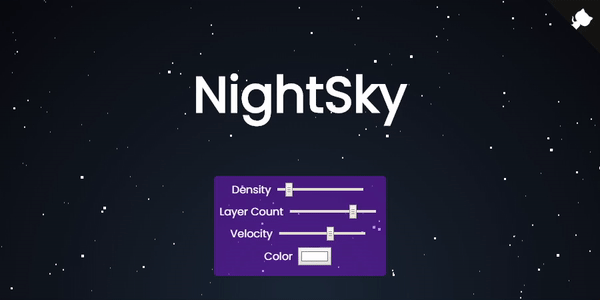

# NightSky

This WebComponent is inspired by the CodePen [Parallax Star background in CSS](https://codepen.io/saransh/pen/BKJun) from [Saransh Sinha](https://codepen.io/saransh). Since this is a WebComponent ir can be easily integrated in any React an Vue app.

 * [Libraries](#libraries)
 * [Usage](#usage)
 * [Documentation](#documentation)

<p align="center">
    
</p>

## Libraries
 * Approach [Parallax Star background in CSS](https://codepen.io/saransh/pen/BKJun)
 * Github Corners [github.com/remarkablemark/github-corners](https://github.com/remarkablemark/github-corners)

 ## Usage
Please checkout the [demo](https://h0rn0chse.github.io/NightSky/demo/). You can add the resources either locally or via a CDN (or as [npm package](https://www.npmjs.com/package/@h0rn0chse/night-sky)):
```html
<script src="https://unpkg.com/@h0rn0chse/night-sky/dist/bundle.min.js"></script>
```

You can add the background as WebComponent.
```html
<night-sky
    id="nightSky"
    layers="4"
    density="30"
    velocity="60"
    starcolor="#FFF"
>
</night-sky>
```
You have to set a size on the background.
```css
#nightSky {
    width: 100vw;
    height: 100vh;
    overflow: hidden;
}
```

## Documentation
The WebComponent allows for some customizations via its attributes:
### layers
The amount of `layers` provided as positive integer.

### density
`density` describes the amount of stars in the first layer in screen with 192x1080px. Each additional layer doubles the amount of stars. It should be provided as positive integer.

### velocity
`velocity` describes the speed of the last layer. Each layer above moves with nth time of this speed. It should be provided as positive or negative integer.

### starcolor
`starcolor` is the color of the star. It should be provided as valid css color.
